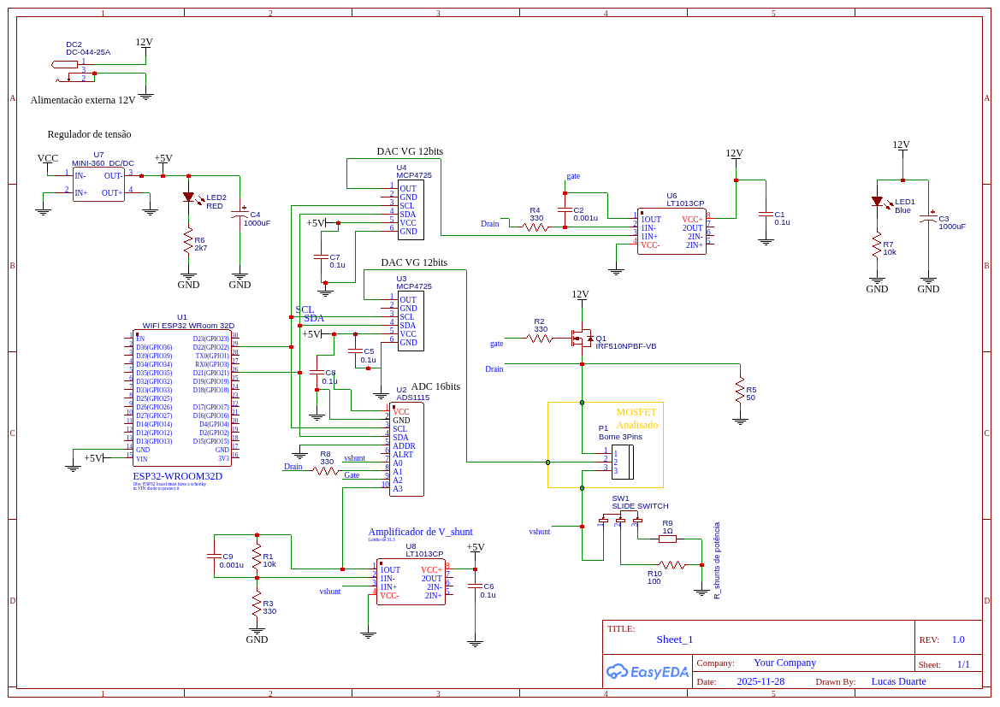
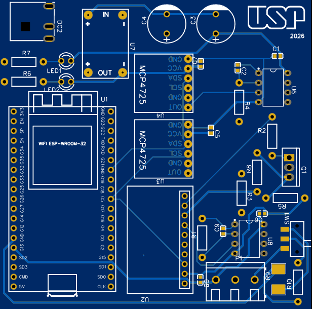
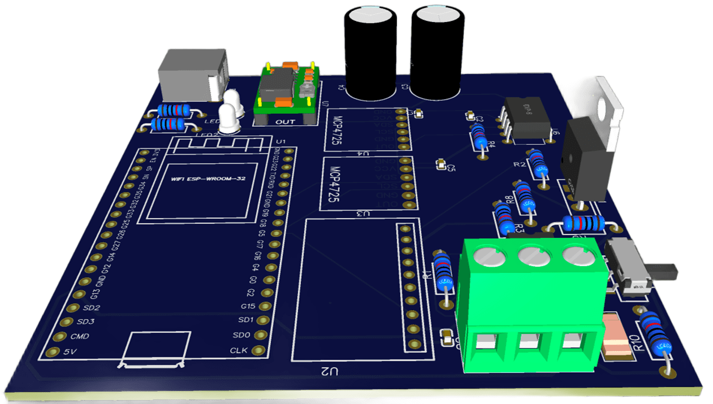

# ESP32 MOSFET Analysis Platform

> Plataforma embarcada de caracterização de MOSFETs com servidor web autossuficiente, controle em malha fechada e extração automática de parâmetros elétricos.
>
> **Firmware:** v10.0.0 · **Target:** ESP32 Wroom 32D · **Interface:** Browser (zero instalação)
>
> [](./LICENSE)

---

## O que é

Um instrumento de bancada baseado em ESP32 que extrai curvas I×V e parâmetros elétricos de MOSFETs — Vth, Gm e Subthreshold Swing — diretamente no dispositivo, sem nenhum software instalado no computador. A interface é uma página web hospedada no próprio ESP32, acessível por qualquer navegador na rede local.

O projeto foi desenvolvido como pesquisa científica (PIBIC, EESC-USP) para demonstrar que é possível obter caracterização metrológica com hardware de ~R$ 200, desde que as limitações sejam compensadas por firmware cuidadoso.

---

## Modos de Operação

| Modo | Sweep | VDS/VGS Fixo | Shunt | Parâmetro Extraído |
|---|---|---|---|---|
| **1 — Subthreshold** | VGS: 0 → 3,5 V | VDS fixo (0,1 V) | 100 Ω | Subthreshold Swing (SS) |
| **2 — Saturação** | VGS: 0 → 5 V | VDS fixo | 1 Ω | Vth, Gm máx |
| **3 — Curva de Saída** | VDS: 0 → 5 V | VGS fixo (família) | 1 Ω | Curva Ids×Vds, região triodo/saturação |

---

## Hardware

### Esquemático



```
ESP32 Wroom 32D  ─── I²C (400 kHz) ───  MCP4725 @ 0x60   (DAC 12-bit, VGS)
                                    ───  MCP4725 @ 0x61   (DAC 12-bit, VDS → buffer LT1013)
                                    ───  ADS1115 @ 0x48   (ADC 16-bit, 4 canais)

ADS1115 canais:
  A0 ← Shunt direto        (backup / alta corrente)
  A1 ← VD via resistor     (realimentação VDS)
  A2 ← VG via resistor     (realimentação VGS)
  A3 ← Shunt × 31,3 (LT1013)  (precisão em baixas correntes)

GPIO14 ── 2N3904 ── GND    (bleeder ativo: descarrega nó de dreno entre medições)
GPIO12 ── jumper GND       (ativa modo debug completo sem recompilação)
```

### Layout PCB

| Vista 2D | Vista 3D |
|:---:|:---:|
|  |  |

**Resolução:**
- DAC: 1,22 mV/passo (MCP4725, Vref = 5 V)
- ADC canal A3: ~7,8 µV/bit efetivo (ADS1115 ganho 16×, oversampling 64×, ENOB ≈ 19 bits)
- Corrente mínima detectável: ordem de nA (canal amplificado A3)
- Faixa operacional validada: 100 mA nominal, proteção automática em 500 mA

---

## Firmware — Decisões Técnicas Relevantes

**Controle em malha fechada:** Cada ponto de medição é calibrado iterativamente. O firmware aplica VGS/VDS alvo, lê os valores reais (A1, A2), calcula o erro e corrige o DAC até |erro| < 2 mV ou 10 iterações. Isso compensa a degeneração de source (queda no shunt) em tempo real.

**Dual shunt com auto-range:** O canal A3 (amplificado ×31,3 via LT1013) é usado como primário. Quando a tensão bruta em A3 ≥ 5,0 V (saturação do amplificador), o sistema troca automaticamente para A0. A transição é transparente na curva gerada.

**Oversampling + Trimmed Mean:** Cada leitura final coleta N amostras (até 64×), ordena por Insertion Sort (stack-only, sem heap), descarta os 10% extremos e retorna a média dos 80% centrais. Elimina spikes de I²C e interferência do Wi-Fi do Core 0.

**Multi-core + mutex I²C:** O servidor HTTP roda no Core 0; a tarefa de medição, no Core 1. Um semáforo protege todas as transações I²C. Requests HTTP são respondidos em < 50 ms durante varreduras ativas.

**Streaming direto para FAT:** Cada ponto é escrito no CSV em FFat imediatamente após a leitura, sem acumular em RAM. Flush a cada 50 linhas. O ESP32 tem 520 KB de RAM — essa decisão torna o tamanho da varredura ilimitado pela memória.

**UI embarcada em PROGMEM:** O HTML/CSS/JS é compilado pelo pre-build hook `scripts/embed_web.py` e servido via arrays PROGMEM. A partição FFat é usada exclusivamente para os CSVs de medição.

---

## Interface Web

**`/` — Coleta:** Configuração de parâmetros, verificação de hardware (probe I²C visual com ✅/❌ por componente), progresso em tempo real com valor de VGS/VDS atual.

**`/visualization` — Análise:** Seleção de CSV armazenado, gráfico interativo (Plotly.js) com Ids em log, Gm, reta tangente do SS e marcador de Vth. Parâmetros exibidos no painel lateral.

**`/email` — Exportação:** Envio de CSVs por SMTP diretamente do ESP32, sem passar pelo computador.

Acesso via mDNS: `http://mosfet.local/`

---

## Formato CSV de Saída

```
# MOSFET Characterization Data
# Firmware: 10.0.0 | HW: Fully External | Rshunt: 100 Ohms
# Shunt: LT1013_gain=31.303951368 | A3_DC_offset=0.000150V | Switch threshold=5.0V
#
timestamp,vd,vg,vd_read,vg_read,vsh,vsh_precise,vds_true,vgs_true,ids
...
# VDS=0.100V: Vt_Gm=1.523V, Vt_SS=1.490V, SS=87.45 mV/dec, MaxGm=2.34e-03 S
```

`vds_true` e `vgs_true` são as tensões reais nos terminais do MOSFET (com subtração da queda no shunt). O CSV contém os metadados completos de cada medição para rastreabilidade.

---

## Como Usar

### 1. Configurar Credenciais Wi-Fi

Copie o arquivo de exemplo e edite com as credenciais da sua rede **2,4 GHz**:

```bash
cp include/secrets.h.example include/secrets.h
```

```cpp
// include/secrets.h
#define WIFI_SSID     "nome_da_sua_rede"
#define WIFI_PASSWORD "sua_senha"
```

> O arquivo `secrets.h` está no `.gitignore` e nunca será enviado ao repositório.

### 2. Compilar e Gravar

Com o [PlatformIO](https://platformio.org/) instalado:

```bash
pio run -t upload
```

O firmware é gravado na flash interna do ESP32. As credenciais Wi-Fi ficam salvas permanentemente — não é necessário regravar a cada uso.

### 3. Acessar o Dashboard

Após o boot, o LED começa a piscar lentamente indicando que o ESP32 conectou ao Wi-Fi com sucesso. Acesse em qualquer navegador na mesma rede:

```
http://mosfet.local/
```

> Se o mDNS não funcionar no seu sistema, use o IP direto exibido no monitor serial (baudrate 115200).

### 4. Realizar uma Medição

1. Na página `/`, clique em **Verificar Hardware** — aguarde ✅ em todos os periféricos I²C.
2. Selecione o **modo de medição** (Subthreshold, Saturação ou Curva de Saída).
3. Selecione o **shunt** correspondente ao modo (100 Ω para subthreshold, 1 Ω para os demais).
4. Configure os parâmetros de varredura (os valores padrão já são adequados para a maioria dos dispositivos).
5. Clique em **Iniciar Medição** e aguarde — o progresso é atualizado em tempo real.
6. Ao concluir, navegue para `/visualization`, selecione o arquivo CSV gerado e analise as curvas e parâmetros extraídos (Vth, Gm, SS).

**Dependências de hardware mínimas:** ESP32 DevKit, 2× MCP4725, ADS1115, LT1013 (×2), 2N3904, shunt 100 Ω e 1 Ω.

---

## Troubleshooting

### O LED não pisca após o boot (Wi-Fi não conectou)

O ESP32 exige rede **2,4 GHz** — redes 5 GHz não são suportadas pelo hardware. Se o SSID ou a senha estiverem incorretos, o dispositivo permanece tentando reconectar em loop e o LED não fica em modo de piscar padrão.

**Solução:** Corrija as credenciais em `include/secrets.h` e execute `pio run -t upload` novamente. O upload regrava a seção de configuração na memória flash permanente — não é necessário fazer nenhum procedimento especial de reset.

### O dashboard não abre em `mosfet.local`

Alguns sistemas operacionais têm suporte limitado a mDNS. Nesse caso:

1. Conecte o ESP32 via USB.
2. Abra um monitor serial com baudrate **115200** (ex: `pio device monitor`).
3. O IP atribuído pelo roteador será exibido logo após a conexão Wi-Fi, no formato:

```
[WiFi] Conectado. IP: 192.168.x.x
```

Acesse `http://192.168.x.x/` diretamente no navegador.

### Hardware não detectado (modal ⚠️ na interface)

Se o probe I²C reportar algum componente como ❌, verifique:
- Alimentação de 5 V nos módulos MCP4725 e ADS1115.
- Conexões SDA/SCL no barramento I²C.
- Endereçamento correto: MCP4725 VGS → `0x60`, MCP4725 VDS → `0x61`, ADS1115 → `0x48`.

O firmware permite iniciar com hardware interno (DAC/ADC do próprio ESP32) como fallback para diagnóstico básico.

---

## Estrutura do Repositório

```
├── src/
│   ├── main.cpp                # Inicialização, servidor HTTP, handlers REST
│   ├── mosfet_controller.cpp   # Máquina de estados, sweep, calibração
│   ├── hardware_hal.cpp        # HAL: DAC/ADC interno e externo
│   └── ...
├── include/
│   ├── hardware_hal.h          # Constantes de hardware, inline shuntAmplifiedAdcToVoltage()
│   ├── mosfet_controller.h     # Configuração de sweep, erros globais, limites
│   └── version.h               # SOFTWARE_VERSION
├── scripts/
│   └── embed_web.py            # Pre-build: HTML/CSS/JS → PROGMEM arrays
├── web/                        # Fonte da UI (collection.js, visualization.js, ...)
├── images/                     # Esquemático EasyEDA, layout PCB 2D e 3D
├── documentation_master.md     # Documentação técnica completa (hardware, firmware, algoritmos)
├── LICENSE                     # Apache 2.0
└── platformio.ini
```

---

## Dispositivos Testados

CD4007 (CMOS gate), 2N7000 (switching), BS170 (AF/RF). Os três operam na faixa de 0–5 V da plataforma e têm perfis elétricos distintos (Vth, SS, Gm), servindo como conjunto de validação cruzada.

---

## Documentação Técnica

O arquivo [`documentation_master.md`](./documentation_master.md) contém a especificação completa: decisões de hardware com justificativas quantitativas, fluxogramas de firmware, algoritmos de cálculo (SS, Vth, Gm), formato do CSV e análise comparativa com o SMU Keysight B2902C.

---

## Licença

Distribuído sob a licença **Apache 2.0**. Consulte o arquivo [LICENSE](./LICENSE) para os termos completos.

---

**Projeto PIBIC — EESC-USP · Lucas Sales Duarte · Orientadora: Profa. Vanessa Cristina Pereira da Silva Venuto**
