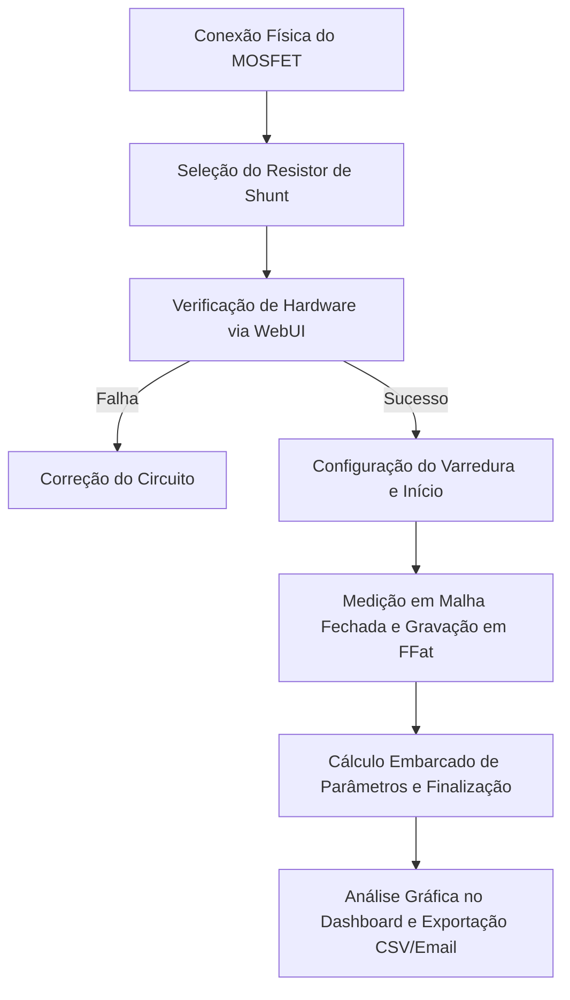

# Objetivo do Sistema (System Purpose)

> **Documentação de Referência - Spec-Driven Development (SDD)**  
> **Versão:** 10.0.0  
> **Status:** Ativo  
> **Data de Atualização:** Junho de 2026  

---

## 1. Propósito Principal do Sistema

O **Caracterizador de MOSFETs ESP32** é um instrumento de bancada de baixo custo projetado para automatizar a aquisição de curvas de comportamento elétrico ($I_{ids} \times V_{gs}$ e $I_{ids} \times V_{ds}$) e extrair parâmetros de modelagem de transistores de efeito de campo de metal-óxido-semicondutor (MOSFET) de canal N e baixa potência. 

O propósito central é democratizar o acesso a ferramentas metrológicas de caracterização em ambientes acadêmicos, laboratoriais e de pesquisa básica, fornecendo um fluxo de trabalho simplificado no navegador sem a necessidade de softwares clientes dedicados.

---

## 2. Problemas que ele Resolve

### 2.1 A Barreira Financeira de Equipamentos Comerciais
Equipamentos comerciais de caracterização de semicondutores — chamados de SMUs (*Source Measure Units*) — como o Keysight B2902C, custam aproximadamente **R$ 85.000,00** (US$ 15.000). Isso torna a caracterização de transistores economicamente inviável para a maioria das universidades públicas brasileiras e laboratórios de ensino de eletrônica. Esta plataforma realiza o escopo básico por menos de **R$ 200,00** (redução de custo > 99%).

### 2.2 Complexidade Operacional e de Software
SMUs tradicionais exigem instalação de drivers específicos (e.g., NI-VISA), configuração de comandos SCPI, softwares pesados de aquisição e exportação manual para planilhas. Este sistema adota uma abordagem de **Instalação Zero**: o microcontrolador gera sua própria página web via Wi-Fi/mDNS, e toda a operação de configuração, visualização e cálculo é concluída no navegador com poucos cliques.

### 2.3 Perda de Rastreabilidade Metrológica em Instrumentos Caseiros
Muitas soluções caseiras baseadas em Arduino ou PIC sofrem de ruído de quantização elevado, não-linearidades do ADC interno e desvio de tensão sob carga. Este sistema compensa essas limitações físicas via firmware (controle em malha fechada, auto-range, oversampling e trimmed mean), garantindo dados confiáveis com exportação de metadados completos para o CSV.

---

## 3. Principais Fluxos de Negócio

### 3.1 Varredura de Gate ($V_{gs}$): Subthreshold e Saturação
* **Região Subthreshold**: Mede correntes da ordem de nanoampères a microampères para caracterizar o mecanismo de difusão de portadores e extrair o *Subthreshold Swing*.
* **Região de Saturação**: Executa a varredura até 5.0 V para traçar o regime parabólico de corrente e extrair a tensão de limiar ($V_{th}$) e transcondutância máxima ($G_m$).

### 3.2 Varredura de Dreno ($V_{ds}$): Curva de Saída
Gera famílias de curvas de corrente de dreno em função da tensão de dreno, variando a tensão de gate em degraus fixos. Permite analisar as regiões de ôhmica/triodo, transição e saturação de dreno do MOSFET.

### 3.3 Análise e Extração de Parâmetros
Cálculo automatizado no final de cada varredura de $V_{gs}$, entregando ao usuário os parâmetros de modelagem calibrados sem a necessidade de processamento pós-coleta em outros softwares.

---

## 4. Atores Envolvidos

* **Estudantes de Engenharia/Física**: Utilizam a plataforma para práticas experimentais de eletrônica analógica e física de semicondutores, correlacionando a teoria dos livros com a prática em tempo real.
* **Pesquisadores/Professores**: Empregam a plataforma para caracterização rápida de lotes de componentes, validação didática de teorias microeletrônicas ou desenvolvimento de pesquisas de semicondutores em laboratórios sem SMUs comerciais.
* **Técnicos de Laboratório/Prototipistas**: Usam o sistema para triagem rápida de transistores, identificação de falsificações ou verificação de componentes danificados.

---

## 5. Funcionalidades Centrais

* **Varredura Automatizada por Software**: Execução autônoma de sweeps lineares de tensão via malha fechada.
* **Closed-Loop Voltage Regulation**: Compensação ativa da queda de tensão no resistor shunt (degeneração de source) para manter exatamente as tensões desejadas nos terminais do MOSFET.
* **Dual-Shunt Auto-Range**: Troca transparente e dinâmica de faixa de medição baseada no valor de corrente atual para evitar saturação analógica do LM358 e manter a resolução em baixas correntes.
* **Servidor Web Autônomo**: Entrega dinâmica do frontend embarcado via `PROGMEM` e interface baseada em REST API JSON.
* **Visualização Gráfica Interativa**: Renderização local das curvas com Plotly.js na WebUI, contendo overlays da reta tangente e marcadores específicos.
* **Armazenamento Seguro de Dados**: Arquivamento local em sistema de arquivos flash (`FFat`) e streaming direto durante a medição.
* **Exportação Multicanal**: Download direto via browser ou envio automático de anexo via e-mail (serviço SMTP nativo).

---

## 6. Visão de Produto

A plataforma não concorre com SMUs profissionais de bancada de alta precisão (na escala de femtoampères), mas preenche a lacuna de **acessibilidade metrológica**: entregar curvas de componente com erro de transcondutância máximo estimado em 10% e tensão de limiar com precisão de $\pm100\text{ mV}$ por uma fração irrisória do custo e com complexidade de uso equivalente a um clique no browser.

---

## 7. Contexto Operacional do Sistema

O sistema é implantado em ambientes de laboratório de bancada. Ele exige:
* Alimentação USB comum de 5 V (fornecida por PC ou fonte linear de baixo ruído).
* Conexão Wi-Fi local operando na frequência de 2.4 GHz (para que o usuário possa acessar o IP ou o endereço de mDNS `http://mosfet.local`).
* Circuito físico analógico contendo o ESP32 interligado via barramento I2C com o ADC ADS1115, os DACs MCP4725, o buffer/amplificador LT1013 e os resistores de shunt de 1 $\Omega$ e 100 $\Omega$.
